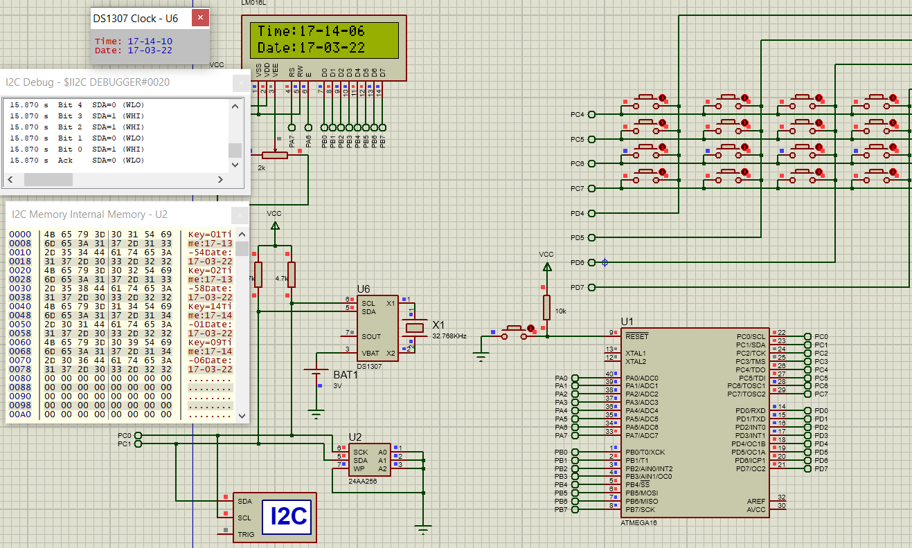

# Final Project
# serial communication I2C (TWI)
# Component:
- Atmega 16a
- EEPROM
- RTC
- LCD
- Keypad 
# Explaining the project 
- When a key from ‘1’ to ‘14’ is pressed, a message is printed to the screen “key = X”, where is X is the key number.
- The logged key is saved in the EEPROM AT24C08 with it’s date and time 
- Key ‘15’ prints to the screen the latest pressed keys and it’s date and time
- Key ‘16’ erases the external EEPROM with a message on LCD “Clearing Mem…”
 

