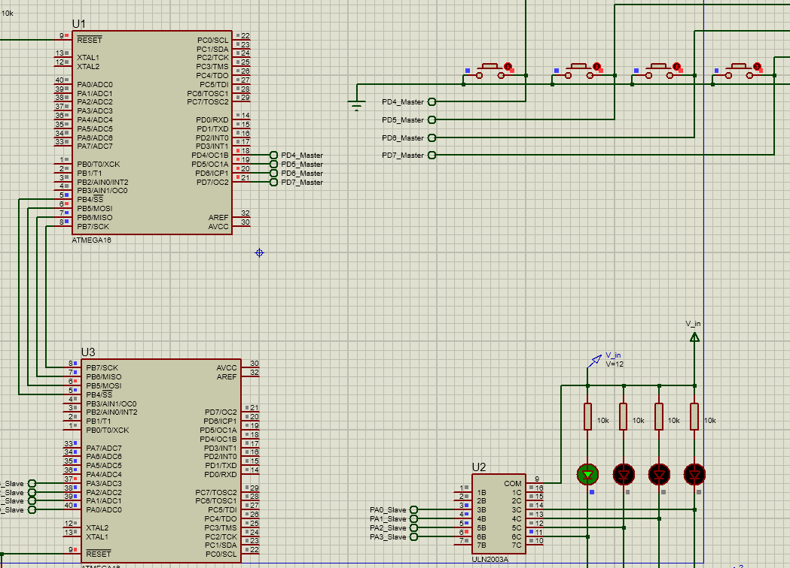

# serial communication SPI TASK
- A master is connected to 4 direct switches.
- A slave is connected to 4 LEDs.
- Each switch when pressed in the master should turn on acorresponding LED in the slave.

