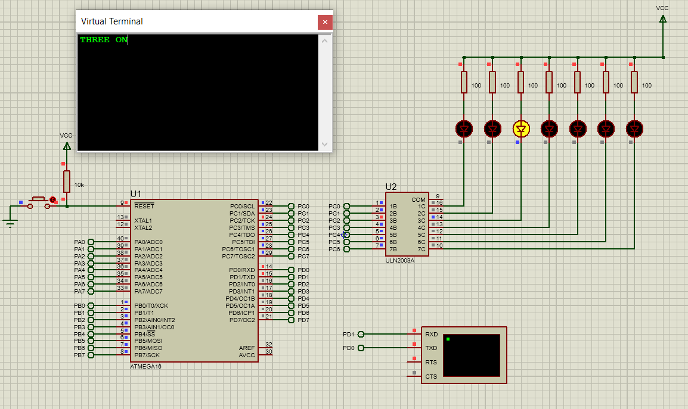

# explanation of the task
- When the microcontroller receives a message of ‘1’ from the terminal virtual model,
the First LED is on, and a message that contains ‘OneON’ is sent to terminal.
- Same for ‘2’ to ‘7’
- When the microcontroller receives a message of ‘0’, all LEDS are off,
and a message that contains ‘AllOFF’ is sent to terminal.
- For other messages, all LEDS are on, and a message that contains ‘ERROR!!’ is sent to terminal.
